# Карта спецификации `broker` — слои и связи

Производный обзор зафиксированных решений. **Источник истины — [`spec.md`](spec.md)**; при расхождении приоритет за ним. Эта карта только визуализирует уже согласованное и не вводит новых правил.
Последнее обновление: 22-07-2026.

Слои (снизу вверх по абстракции):

- **Слой 0 — Методология и принципы** — как ведётся сама спецификация.
- **Слой 1 — Назначение и транспорт** — что такое `broker` и как течёт событие.
- **Слой 2 — Хранилище (Heap)** — таблицы брокера.
- **Слой 3 — Бизнес-логика** — хэширование токена и регистрация модуля.
- **Слой 4 — Тестирование и приёмка** — как проверяется каждая волна.
- **Открытые вопросы** — что ещё в проработке.

---

## Слой 0 — Методология и принципы

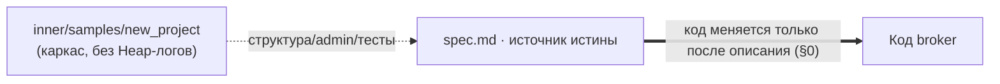

- **spec-as-source (§0).** Редактировать код запрещено, пока изменение не описано в `spec.md`. Готовой реализации, с которой списываем, нет — спека единственный источник.
- **Каркас — из `new_project`.** Структура проекта, admin API, тесты — из `inner/samples/new_project`, но **без его Heap-логирования и таблицы логов** (§5.10: логи в ClickHouse, своей таблицы нет). Прежний эталон `p/template_metaproject` отвязан: его брокер устарел в каждом решении, логгер — под Heap.
- **Словарь терминов.** Англоязычные термины — либо в словаре (если оправданы), либо переведены.
- **Состояние vs история.** На строке таблицы хранится только текущее состояние; история (вкл/выкл, регистрация) — отдельными событиями брокера.

---

## Слой 1 — Назначение и транспорт

`broker` — глобальный брокер событий уровня аккаунта поверх Heap: один на аккаунт, продукт-независимый; FLOW и прочие модули — его клиенты.

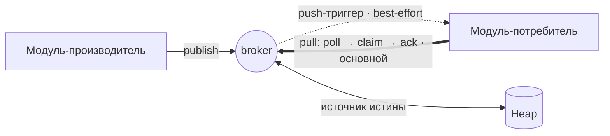

- **Транспорт — pull-driven** (ADR-0004): подписчик сам забирает доставки (`poll→claim→ack`); push — только best-effort **триггер** «проснись», данные не переносит.
- **Забор — одна атомарная операция** (ADR-0012): `poll` и `claim` слиты в `fetchDeliveries` — строки отдаются уже застолблёнными. Разнесение допускало бы состояние «отдано, но не помечено» (падение между вызовами → повторная выдача).
- **Гранулярность pull-API (§5.9, О1 закрыт):** забор батчем, закрытие поодиночке — `fetchDeliveries` (список) + `ackDelivery` / `deadDelivery` (одна доставка). Списками оперирует брокер, подписчик — единицами: получил пачку, обработал по одному, по одному ответил.
- **Гонка двойного claim (§5.9, О3, ADR-0014):** захват — **построчный CAS** на `updateAll`, `where` повторяет прочитанное состояние (`{ id, status: 'pending' }` либо `{ id, status: 'claimed', claimedAt < cutoff }`), `1` — взяли, `0` — перехватили, пропускаем. Блокировки на пути забора нет: воркеры одного модуля работают параллельно. Атомарность `updateAll` подтверждена прогоном 20-07-2026. Вариант с замком отвергнут: сериализует заборы одного модуля.
- **Форма выборки (§5.9, О4 закрыт):** один запрос `$and: [{ subscriberModuleKey }, { $or: [pending, claimed+просрочка] }]`, порядок по `createdAt`, лимит батча. Смешивать поле и `$or` на одном уровне `where` типы запрещают. Два запроса с merge отклонены: `BrokerDeliveries` — рабочая очередь (retention §3.5), не журнал; крупные выборки — в ClickHouse (§3.4). Остальные решения §5.9 — в проработке.
- **Самодостаточная доставка:** несёт снимок события (`payload`), обрабатывается из своей таблицы; общий журнал/архив на рантайме **не читаются** (они — история/аудит). Отставший подписчик payload не теряет.
- **Ретраи — на стороне модуля:** просроченная `claimed` (старше `claimTimeoutMs ?? 1 мин`, §3.1) возвращается подписчику на его следующем pull; просрочку считает серверная выборка, но инициатива за модулем — брокер сам статус не сбрасывает и повторно не пушит. Число попыток и внутреннюю очередь ведёт модуль; исчерпав — ставит `dead`.
- **Контракт `payload` — вне брокера:** структуру данных согласуют между собой продюсер и подписчики в своём коде; брокер переносит `schemaVersion` непрозрачным тегом, не хранит и не валидирует сам контракт (§8).
- **Гарантия:** at-least-once; потребитель обязан быть идемпотентным; порядок — best-effort по `createdAt` доставки.
- **Двойная обработка — на подписчике (решено 20-07-2026).** Таймаут не отличает «воркер умер» от «работает медленно», поэтому выбор всегда между дублями и зависаниями; выбраны дубли. Дедуп по `eventId` ведёт модуль, брокер её не предоставляет. Со стороны брокера дубль только сужается: `claimToken` решает, чей отчёт принять. Сузить окно сильнее брокер не пытается: это потребовало бы операций сверх зафиксированных трёх и фоновой активности в каждом модуле. Вопрос открывается заново, если обработка у живых подписчиков начнёт регулярно перешагивать таймаут.
- **Источник истины** о статусе доставки — таблицы брокера.

---

## Слой 2 — Хранилище (Heap)

**Ограничение платформы (§3):** (1) индексами Heap управлять нельзя — нет ни создания, ни хинтов, ни `explain()`; планы строит PostgreSQL. (2) **Индексируются только плоские поля на корневом уровне** (подтверждено поддержкой); массивы, `Heap.Object`, `Heap.Any` — скан, и типизация вместо `Any` индекса не даёт. Единственный рычаг — форма схемы: **фильтруешь на горячем пути — поле корневое и плоское** (так вынесен `schemaVersion`, ADR-0003). Осознанное исключение — `$includes` по `allowedSubscribeTypes` на fan-out: скан, допустимый только потому, что `BrokerModules` не растёт (§3.1). Остальное закладывается объёмом таблиц (retention §3.5) и формой данных (§3.2), а не настройкой запросов.

**Системный `id` (§3):** длинная случайная строка, неперебираем. Скрывать существование строки при отказе по `id` не требуется (§5.9.5); наружу `id` годится как непрозрачная ссылка.

**Идентификаторы таблиц (§3, зафиксированы) — парами stage/prod:** `t__broker__<таблица>__stage_<хвост>` / `…__prod_<хвост>` (modules `wI7S9L`, events `BOnFpq`, deliveries `fk9ze2`, events-arch `LO6Zki`, settings `I7Ozm8`). Имя задаёт разработчик (платформа не генерирует; тип запрещает только двоеточие), формат — соглашение воркспейса: аккаунт платформа изолирует сама, проекты внутри аккаунта — нет; сегмент окружения разводит stage/prod-наборы. Пара объявляется с общим объектом полей, наружу из `.table.ts` экспортируется только репозиторий, выбранный статическим селектором `IS_PROD` из `PROJECT_ROOT` (dev-копия `d/system/broker` → stage, prod-копия `p/system/broker` → prod; все пять таблиц парные, общих нет — `008-heap.md`/`006-arch.md`). ⚠️ Неизменяемы: переименование молча уводит код на новую пустую таблицу.

**Системные поля (§3):** `id`/`createdAt`/`updatedAt` нельзя ни объявлять в схеме, ни передавать в `create()`/`update()`. Следствие — строку не датировать задним числом: ре-материализованные доставки получат время материализации и встанут в порядке как самые свежие.

**Типы времени (§3):** системные `createdAt`/`updatedAt` — `Date` (в `where` сравниваются с `new Date(...)`); наши объявляемые отметки (`claimedAt`, `dispatchedAt`, `batchFrom`/`batchTo`) — `number` (epoch ms). На стыке конвертация явная: `.getTime()`.

### `BrokerModules` — реестр модулей (согласована)

| Поле                                            | Назначение                                                                                                                                                                                                                                                                                                                                                                            |
| ----------------------------------------------- | ------------------------------------------------------------------------------------------------------------------------------------------------------------------------------------------------------------------------------------------------------------------------------------------------------------------------------------------------------------------------------------- |
| `moduleKey`                                     | Уникальный ключ модуля. Ключ upsert.                                                                                                                                                                                                                                                                                                                                                  |
| `displayName`                                   | Имя для админ-диагностики.                                                                                                                                                                                                                                                                                                                                                            |
| `source`                                        | `internal` / `external`. Проставляет гейтвей по каналу регистрации, не из тела запроса.                                                                                                                                                                                                                                                                                               |
| `allowedPublishTypes`                           | Белый список glob-паттернов публикаций. Пустой = запрет.                                                                                                                                                                                                                                                                                                                              |
| `allowedSubscribeTypes`                         | Белый список glob-паттернов подписок. Пустой = запрет. Fan-out резолвит подписчиков из этого поля: `where status=active` + развёртка предков-глобов `eventType` + `$includes/$any` (**скан, не индекс** — массивы не индексируются; допустим, т.к. реестр не растёт, §3.1) — доставки только активным; отдельной таблицы подписок нет, роутинг по типу, продюсер анонимен (ADR-0008). |
| `status`                                        | **Операционное** состояние единым полем (ADR-0010): `onModeration` / `active` / `disabled`. «Активен сейчас» = `active`, без исключений; `disabled` только из `active`. Переходы — `broker.*` события (ADR-0009). Начальное по `source` (см. Слой 3). Наличие заявки на модерацию статусом **не** выражается.                                                                         |
| `pendingPublishTypes` / `pendingSubscribeTypes` | Запрошенное, ещё не одобренное расширение (`null` — заявки нет). Читает только админка модерации; publish-проверка и fan-out их не видят, поэтому модуль с заявкой работает на одобренных правах.                                                                                                                                                                                     |
| `claimTimeoutMs`                                | **Опционально.** Переопределение таймаута перезабора взятой доставки; не задан → дефолт брокера 1 мин (`DEFAULT_CLAIM_TIMEOUT_MS = 60_000`). Просрочку считает серверная выборка `fetchDeliveries` (§5.9, О2).                                                                                                                                                                        |
| `authTokenHash`                                 | SHA-256 токена, выданного гейтвеем. Токен отдаётся модулю один раз.                                                                                                                                                                                                                                                                                                                   |
| `metadata`                                      | Произвольные данные модуля.                                                                                                                                                                                                                                                                                                                                                           |

Системные поля Heap (добавляются автоматически, не объявляются): `id` — первичный ключ строки (идентичность модуля — по `moduleKey`, см. ADR-0001); `createdAt` / `updatedAt` — время создания строки / последнего upsert.

### `BrokerEvents` — журнал опубликованных событий (согласована)

Неизменяемый append-only журнал фактов; источник истины (§1). Фактическая часть события не редактируется (мутирует лишь служебный `dispatchedAt`, разовый `null → timestamp`) и не удаляется — при удалении модуля его события остаются (§5.5).

| Поле                | Назначение                                                                                                                                                                                                                                                                                                                                                                                                                                                                       |
| ------------------- | -------------------------------------------------------------------------------------------------------------------------------------------------------------------------------------------------------------------------------------------------------------------------------------------------------------------------------------------------------------------------------------------------------------------------------------------------------------------------------- | --- | -------------- | ----------------------------------------------------------------------------------------------------------------------------------------------------------------------------------------- |
| `eventType`         | Доменный тип (`tasks.created`). Сверяется с `allowedPublishTypes` при публикации, `allowedSubscribeTypes` при доставке.                                                                                                                                                                                                                                                                                                                                                          |
| `schemaVersion`     | Версия схемы `payload` внутри типа (целое, default `1`). Отдельным полем — для `where`-фильтра по версии **по индексу**: корневое плоское поле индексируется, а внутрь `any`-payload Heap фильтровать умеет, но сканом JSONB (ADR-0003; вынос из `payload` — единственный способ получить здесь индекс, §3); непрозрачный тег, брокер контракт по `(eventType, schemaVersion)` не хранит и не проверяет (§1, §8). Бамп ≠ новый тип (вайтлисты/модерация не трогаются). ADR-0003. |
| `producerModuleKey` | `moduleKey` продюсера обычной строкой (не `RefLink`, §5.5). Multi-producer: один тип — у разных модулей.                                                                                                                                                                                                                                                                                                                                                                         |
| `payload`           | Данные факта (JSON). Структуру по `(eventType, schemaVersion)` согласуют продюсер и подписчики в своём коде — вне брокера (§1, §8).                                                                                                                                                                                                                                                                                                                                              |
| `idempotencyKey`    | Дедуп публикации от продюсера (опц., пусто → без дедупа). Уникальность `(producerModuleKey, idempotencyKey)`, проверка `runWithExclusiveLock` (§5).                                                                                                                                                                                                                                                                                                                              |     | `dispatchedAt` | `number \| null`. «fan-out завершён» — ставится **после всех** строк `BrokerDeliveries`; `null` → рассылка не завершена (восстановление повторяет fan-out). Единственное мутируемое поле. |

Системные поля: `id` — идентификатор события (на него ссылаются `BrokerDeliveries` строкой); `createdAt` — момент публикации (отметка для best-effort порядка); `updatedAt` не используется (журнал неизменяем).

Служебные поля публикации (объявлены выше; сам flow — `publishEvent` + fan-out-дренер, §5.8): дедуп события по `(producerModuleKey, idempotencyKey)`; `dispatchedAt` ставит **дренер** после ВСЕХ доставок, fan-out **асинхронный** (дренер сканирует `dispatchedAt=null`, он же recovery); **повтор fan-out идемпотентен по ключу ДОСТАВКИ `(eventId, subscriberModuleKey)`, а не по `idempotencyKey` события** (два слоя идемпотентности, разные ключи). Порядок — best-effort по `createdAt` (счётчик `seq` убран, глобальный лок не окупает). История операций — **решена**: системные `broker.*` события в этом же журнале (продюсер — внутренний код брокера, сентинел `producerModuleKey=broker`, в обход `assertCanPublish`; namespace `broker.` и `moduleKey=broker` зарезервированы — публиковать модулям нельзя, подписываться можно), фан-аут единообразный, отдельной таблицы нет (ADR-0009).

### `BrokerDeliveries` — материализованные доставки (согласована)

**Самодостаточный рабочий элемент для pull** (ADR-0006). fan-out создаёт по строке на каждого подписчика события (§3.2) и **кладёт в неё снимок события** (`eventType` + `schemaVersion` + `payload`). Модуль обрабатывает целиком из своей таблицы — **общий журнал на рантайме не читает** («толстая» доставка: меньше запросов и точек отказа, ценой временного дублирования payload). Жизненный цикл ведёт сам подписчик через pull (§1), брокер хранит статус.

| Поле                  | Назначение                                                                                                                                                                                                                                                                                           |
| --------------------- | ---------------------------------------------------------------------------------------------------------------------------------------------------------------------------------------------------------------------------------------------------------------------------------------------------- |
| `eventId`             | `id` события строкой (не `RefLink`) — обратная ссылка для трассировки, **не** для дозагрузки.                                                                                                                                                                                                        |
| `eventType`           | Тип-снимок: фильтр pull + вход бизнес-логики.                                                                                                                                                                                                                                                        |
| `schemaVersion`       | Версия схемы `payload` (снимок): по `(eventType, schemaVersion)` подписчик знает, как читать payload.                                                                                                                                                                                                |
| `payload`             | **Снимок данных события**, скопирован при fan-out — доставка самодостаточна. Маленький факт (обычно сотни байт; 8 КБ — потолок **брокера**, не платформы, `JSON.stringify().length`; движется только вверх, §8; крупное — ссылкой на файл).                                                          |
| `subscriberModuleKey` | `moduleKey` подписчика строкой (не `RefLink`, §5.5).                                                                                                                                                                                                                                                 |
| `status`              | `pending` → `claimed` → `acked` / `dead`. `failed` нет: неподтверждённая `claimed` = повтор (перезабор после таймаута). Закрытие требует `claimed` + совпадения `claimToken`; повтор того же закрытия — идемпотентный успех, всё прочее — отказ (§5.9, О6).                                          |
| `claimedAt`           | Момент последнего claim; основа перезабора (просрочка по эффективному `claimTimeoutMs ?? 1 мин`, §3.1).                                                                                                                                                                                              |
| `claimCount`          | Сколько раз доставку **выдавали** (инкрементит брокер той же записью, что claim — бесплатно). Не `attempts`: брокер знает выдачи, не попытки обработки. Строго диагностический — автоперевода в `dead` по порогу нет (§1). Высокое значение = ядовитое сообщение либо циклически падающий подписчик. |
| `lastError`           | Причина финальной сдачи, опц. параметр `deadDelivery`. Лимит ~1000 символов, **обрезается, а не отклоняется** (модуль в аварийной ветке — подвесить закрытие из-за длины нельзя). Для человека, не контракт. Не история — только последняя причина.                                                  |
| `claimToken`          | Метка захвата (`nanoid`), новая при **каждом** claim. Предъявляется обратно при ack/dead — отчёт принимается только от текущего держателя (§5.9, О6). После терминала сохраняется: на ней держится идемпотентность повтора.                                                                          |

Жизненный цикл: fan-out → `pending` (со снимком), идемпотентно по `(eventId, subscriberModuleKey)` (под `runWithExclusiveLock(ctx, [LOCK_NS + '-fanout', eventId], fn)`, §5.8); на pull подписчик берёт свои `pending` + просроченные `claimed` (порядок по `createdAt` доставки), ставит `claimed`+`claimedAt`, обрабатывает **прямо по строке**, успех → `acked`, упал → перезабор после таймаута; исчерпав попытки (политика модуля) → `dead`. Опц. поля: `attempts`, `lastError` (без `subscriptionId` — отдельной сущности-подписки нет, матч по типу через whitelist, ADR-0008). Системные: `id`, `createdAt` (материализация; основа retention и порядка), `updatedAt` (последний переход). `eventCreatedAt` не нужен (порядок — по `createdAt` доставки).

### `BrokerEventsArchive` — холодный архив журнала (согласована)

Журнал — **неизменяемая история** (аудит, ре-материализация, ручной разбор); на рантайме доставки не читается (доставка самодостаточна). Лимит 1 млн строк/таблицу несовместим с ростом, удалять события нельзя → **гибрид (ADR-0011): Heap-якорь истины на двух уровнях + best-effort ClickHouse-зеркало.** (1) горячая `BrokerEvents` = последний месяц (+ «хвост»); (2) **инлайновые строки архива ~8 КБ** (ADR-0005; оптимум записи Heap `008-heap.md`; данные в самой таблице, запрос через `where`). Поля: `batchFrom`/`batchTo`, `count`, `events`. Граница инлайн-строки — по размеру: суммируем `JSON.stringify(ev).length` (символы; `Buffer`/`TextEncoder` в UGC может не быть — `047-base64.md`), таргет ~8 КБ, сбрасываем только **полную**. Чтение уровня 2 — диагностика/админка (`where` по диапазону). Ёмкость архива — единицы-десятки млн (для FLOW достаточно; вынос за пределы Heap понадобился бы только у лимита таблицы — не спроектирован, §0.1). **ClickHouse-зеркало (ADR-0011):** fan-out (§5.8) best-effort пишет событие в CH (`writeWorkspaceEvent`, `inner/docs/049-clickhouse.md`) для аналитики/дашбордов и удобного реплея; **не источник истины** (best-effort/эвентуально, возможны дубли — дедуп по `eventId`; `payload` JSON-полем); удаление из Heap на CH-запись не завязано.

**Retention-джоб (ежедневно в полночь, общий для брокера).** Один `app.job` каждую полночь, самоперепланирование `scheduleJobAt(00:00)` **первым действием** (не в конце: переросший бюджет проход обрывается после тяжёлой операции, код за ней не исполняется — §3.5, `008-heap.md`; стой перепланирование в конце, цепочка встала бы навсегда), **два прохода**:

1. **Очистка доставок:** `acked` старше 24ч и `dead` старше 30 дней → `deleteAll({ limit: null, hard: true })`, по одному вызову на каждое условие. Числовой `limit` — предохранитель (падает, если строк больше), а не размер партии, поэтому батчить через него нельзя; `hard` обязателен, иначе строки останутся и лимит таблицы будет достигнут при работающей чистке. ≈0.8 мс/строку, в 60 с влезает ~75 000. Нарезка по окнам не вводится — парный лог `start`/`done` (непарность = переросший бюджет) + `durationMs`. `dead` **не архивируем** (факт события хранит журнал), `pending`/`claimed` не трогаются.
2. **Архивация событий старше месяца, строки по ~8 КБ:** тянем старые (`updatedAt < new Date(now − 1мес)`, `asc`), набираем полную строку → `BrokerEventsArchive` (`batchFrom`/`batchTo` — через `.getTime()`). «Хвост» ждёт. Порядок «архив → удаление по `id`» — без потерь; полнота — по «остался невлезший кандидат».

### `BrokerSettings` — операционные настройки (согласована)

Generic **key-value** (`key: string`, `value: any`) — как настроечная таблица во всех проектах воркспейса. Хранит операционную конфигурацию брокера: `log_level` (§5.10.8) и будущие настройки — новая настройка = новая **строка**, а не поле, поэтому формы строки таблица **не замораживает** (не гейт §0.1). Таблица, а не config-файл: будущий секрет (токен, ключ) остаётся в БД и не попадает в репозиторий/синк; правка построчная (не read-modify-write всего файла); это устоявшийся паттерн. Уникальность `key` — по соглашению (`findOneBy → update|create`, БД-гарантии нет, §3.3). Чтение внутри логгера **не логируется** (§5.10.9, боевой `getLogLevel`). Retention её не трогает.

### Топология хранилища (все таблицы согласованы)

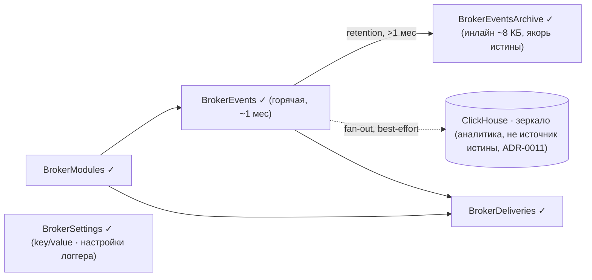

Отдельных таблиц под контракты, подписки и операционный аудит **нет**: контракт `payload` — вне брокера (§1, §8 spec.md); подписка — whitelist по типу на строке модуля (роутинг по типу, продюсер анонимен, ADR-0008); операционная история — системные `broker.*` события в журнале `BrokerEvents` (ADR-0009).

---

## Слой 3 — Бизнес-логика

### Логирование (§5.10)

Единая точка — `writeServerLog(ctx, { level, message, payload?, marks? })`; прямые `ctx.account.log` в коде брокера запрещены (обходят отсечку, не попадают в живой монитор, не подчиняются политике payload). **Своей таблицы логов нет** — `ctx.account.log` уже пишет в ClickHouse `chatium_ai.account_logs`, Heap-копия была бы вторым экземпляром тех же данных.

`message` — сырой текст без времени и уровня (платформа хранит их колонками, дублирование мешало бы поиску). `payload` → `json_str` сериализованной строкой, `marks` → `kv` строкой `"key=value ..."` — отсюда правило: в `marks` короткие идентификаторы для поиска, в `payload` остальное.

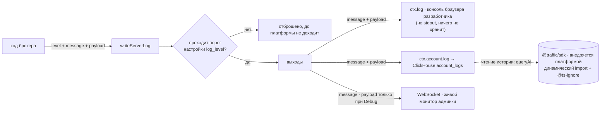

- **Уровни — платформенные** (`error`/`warn`/`info`/`debug` из семи возможных), своя syslog-шкала не вводится: понадобилось бы отображение при записи и разбор при чтении без выигрыша.
- **Настройка `log_level`** (`Disable`/`Error`/`Warn`/`Info`/`Debug`, дефолт `Info`) отсекает **до** вызова платформы, а не на чтении.
- **Payload: в ClickHouse и dev-консоль — всегда, в сокет живого монитора — только на `Debug`** (§5.10.5). Хранилище от payload не страдает (списочный `readLogs` `json_str` не тянет); живой поток админки по умолчанию компактен.
- **Рекурсия:** чтение настроек логгера логировать через `writeServerLog` нельзя — `RangeError` на ~1300-м вызове, мгновенное падение запроса.
- **Чтение истории:** `readLogs` через `queryAi`; обязательны фильтр `workspace_path` (= корень копии: stage `d/system/broker` — **подтверждено прогоном 22-07-2026**; prod `p/system/broker` — подтверждается лог-тестом при первом переносе, §0.1) и временные условия средствами SQL (`ts64` — `DateTime64`). `total` — отдельным `count()` для пагинации.
- Платформенная механика (`ctx.account.log` vs `ctx.console`, импорт `queryAi`, колонки) — `inner/docs/050-logging.md`.
- **Чтение истории — `queryAi`** (прототип 21-07-2026: `ts64` это `DateTime64(3,'UTC')`, работают `LIMIT/OFFSET`, `count()`, `LIKE`/`ILIKE`, `JSONExtractString`; запись ~5 мс, запрос ~120 мс): динамический `await import('@traffic/sdk')` с `@ts-ignore`, модуль внедряется платформой и в `node_modules` отсутствует. Ответ `{ rows: [] }`, `ts64` — строка, `kv` — `"key=value ..."`, задержка записи практически нулевая. Отбор своих записей — по `workspace_path`, таблица общая на аккаунт. `queryAccountLogs`/`listAccountLogs` из `@app/ugc` не использовать: `Method not found` в рантайме.

### §5.1 Хэширование токена

- Настоящий **SHA-256** через `@npm/node-forge` (нативного `crypto` в Chatium нет).
- Вход: `broker-module-auth:<moduleKey>:<token>` (доменный префикс + привязка к модулю).
- **Не** FNV-1a: `authTokenHash` — граница доверия, 32-битный отпечаток к подбору не устойчив.

### §5.2 Регистрация модуля

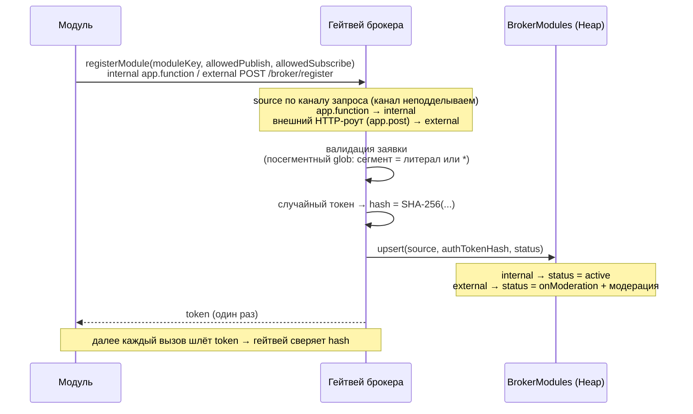

Хэш в БД при утечке рабочего креденциала не даёт: сравнивается хэш входящего токена, сам токен не хранится.

### §5.3 / §5.4 Обновление белых списков (черновик)

Смена `allowedPublishTypes` (§5.3, операция `updatePublishTypes` · `POST /broker/publish-types`) и `allowedSubscribeTypes` (§5.4, операция `updateSubscribeTypes` · `POST /broker/subscribe-types`) — отдельные операции, не ре-регистрация: `moduleKey` / `source` / токен неизменны. Создание — только `registerModule` (§5.2).

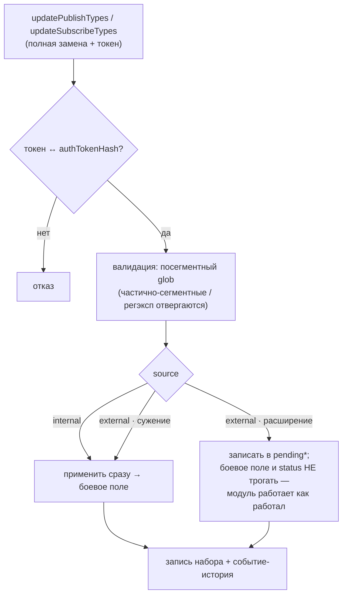

- `source` берётся из строки, **не** переопределяется каналом (в отличие от регистрации).
- Пустой массив = право отозвано (publish / subscribe запрещены).
- **Заявка на расширение работу не останавливает** (ADR-0010): запрошенный набор лежит в `pendingPublishTypes`/`pendingSubscribeTypes`, боевой не меняется, `status` остаётся `active`. Не одобрено — просто не добавилось.

### §5.5 Удаление регистрации (черновик)

`deleteModule` (`POST /broker/delete`) — токен-гейт, только по существующей строке, **без модерации** (сокращение присутствия, не расширение прав). Строка удаляется, факт — `broker.*` событием-историей; `moduleKey` **освобождается** → можно занять заново через `registerModule`. Админ-снятие — это статус `disabled`, не `deleteModule`.

**Каскад при удалении (решено):** события остаются (журнал/архив, строковый `producerModuleKey`); **все** доставки с `subscriberModuleKey` модуля удаляются независимо от статуса (иначе мисатрибуция при повторном занятии освободившегося ключа); подписки отдельно не каскадируются — это whitelist на строке `BrokerModules`, удаляется вместе с ней (ADR-0008).

Жизненный цикл: `registerModule` (create) → `updatePublishTypes` / `updateSubscribeTypes` (mutate) → `disableModule` / `enableModule` (админ: `active`↔`disabled`, §5.7) → `deleteModule` (remove, освобождает ключ).

### §5.6 Модерация

**Админ-операции** (`requireAccountRole(ctx, 'Admin')`, не токен модуля). Не модульный API — вызываются из админ-страницы брокера через `.run()` (роут `// @shared-route`), без `app.function` и без HTTP-эндпоинта для модулей. Идентификатор — `moduleKey`. Очередь собирается по **двум разным признакам** (оба только `external`):

| Случай                           | Признак                   | Модуль сейчас          | Одобрение делает                   |
| -------------------------------- | ------------------------- | ---------------------- | ---------------------------------- |
| Первичная заявка (§5.2)          | `status = 'onModeration'` | не запущен             | `status = 'active'` — запускает    |
| Заявка на расширение (§5.3/§5.4) | непустой `pending*`       | **работает**, `active` | переносит `pending*` в боевое поле |

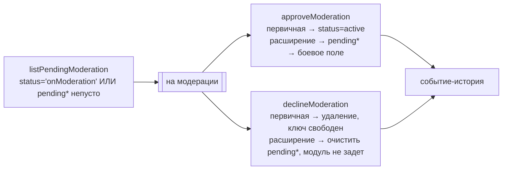

Отклонение расширения — **полный автоматический откат**: одобренный набор не затирался, очищается только заявка.

### §5.7 Выключение / включение (админ)

Помимо модерации — админ-операции `disableModule` (`active`→`disabled`, только из `active`) и `enableModule` (`disabled`→`active`, на текущем наборе). Выключенный модуль не участвует: публикации отклоняются, fan-out его пропускает (доставки — только `status=active`); уже созданные доставки ждут включения. Переходы — `broker.*` события.

### §5.8 publishEvent + fan-out-дренер

Центральная операция. **Двухфазная, fan-out асинхронный** (поглощает всплески публикаций без backpressure/потерь):

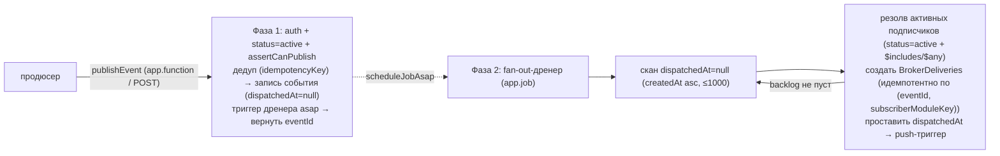

- Фаза 1 — минимум синхронной работы (запись + дедуп); скачок запросов не транслируется в скачок fan-out на Heap.
- **Ключи замков — массив `[LOCK_NS + '-' + назначение, …]`, `LOCK_NS = IS_PROD ? 'broker' : 'broker-stage'`** (§5.8): `[LOCK_NS + '-register', moduleKey]`, `[LOCK_NS + '-dedup', producerModuleKey, idempotencyKey]`, `[LOCK_NS + '-fanout', eventId]`, `[LOCK_NS + '-drainer']`; в коде — единственный хелпер `lockKey()`. Массив, а не склейка переменных частей — иначе `a:b`+`c` и `a`+`b:c` дают один замок. Первый элемент **уникален на назначение** (RV 22-07-2026: общий первый элемент деградирует захват до ~5с-поллов под конкуренцией); сегмент окружения — потому что иначе stage- и prod-копии делят один замок.
- Дренер = основной путь fan-out **и** recovery (незавершённое = `dispatchedAt=null`, подхватится). Отдельной `@app/jobs`-очереди на fan-out не нужно — очередь это сам журнал (`dispatchedAt=null`).
- Порядок best-effort по `createdAt`; auth — токен, единообразно для всех модулей (`source` на аутентификацию не влияет). Bulk — чанкует **продюсер** своей custom job queue (`005-jobs.md`); batch-publish пока не вводится (иначе с кэпом / брокерской очередью приёма).

### §5.9 Pull-API подписчика

Выходная дверь: три операции, все требуют токен и `status = 'active'`. Все 7 решений (О1–О7) закрыты, раздел развёрнут в контракты.

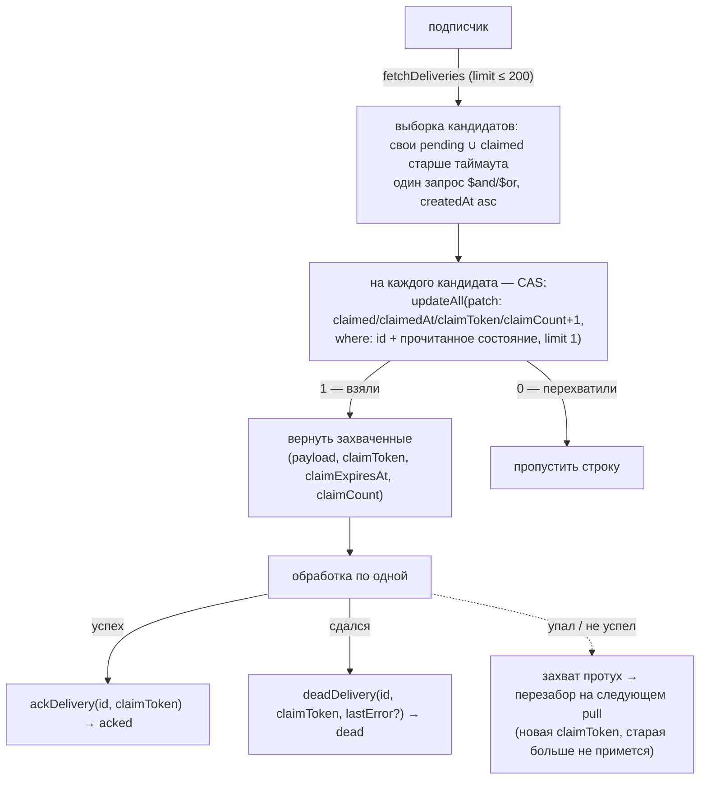

- **Закрытие — три проверки:** принадлежность модулю (нет строки либо чужая → единый `AccessDeniedError`, `NotFoundError` не используется: модуль адресует только свои доставки, «не найдено» отправило бы искать не там; различие уходит в лог брокера, не в ответ), принадлежность захвату (`claimToken`, иначе `claimSuperseded`), статус `claimed`. Повтор того же закрытия — идемпотентный успех, различимый в ответе (`alreadyAcked`/`alreadyDead`).
- **`limit` зажат с двух сторон:** сверху — пачку столбят сразу, значит её надо успеть обработать за `claimTimeoutMs`; снизу — забор стоит N+1 последовательных запросов в бюджете **одного вызова (20 с)**, и очередями это не дробится. Дефолт 50, потолок 200. Рычаги при нехватке: снизить потолок либо батчевый захват по списку `id` (~5 запросов, ADR-0014 — препятствие только `claimCount`).
- **Отдать могут меньше, чем просили** — проигранные CAS-гонки выпадают. Штатно и саморегулируется.
- **Ответ — конверт `BrokerResult`, не исключения** (§5.9.5): всегда 200, семантика в теле (`{ success, code, error, details? }`). У платформы нет статуса «конфликт состояния», а заворачивать его в 422 значит терять различие «запрос неверен» / «состояние другое». Исключение одно — отказ аутентификации остаётся `AccessDeniedError` 403.
- **Коды разделены намеренно:** `invalid_claim_token` — штатное опоздание воркера (severity 4); `delivery_not_claimed` — противоречие, повод расследовать (severity 3); `delivery_unavailable` — один код на «нет строки» и «чужая строка», различие уходит в лог.

---

## Слой 4 — Тестирование и приёмка (§9)

Спека проверяется **растущим набором тестов на штатной системе Chatium** (`inner/docs/020-testing.md`, решение — [ADR-0015](../ADR/0015-testing-strategy-native-row-isolation.md)), а не самодельной обвязкой. Две вещи не независимы: **приёмочный сценарий волны = дельта общего набора, которую волна вносит и зеленит**.

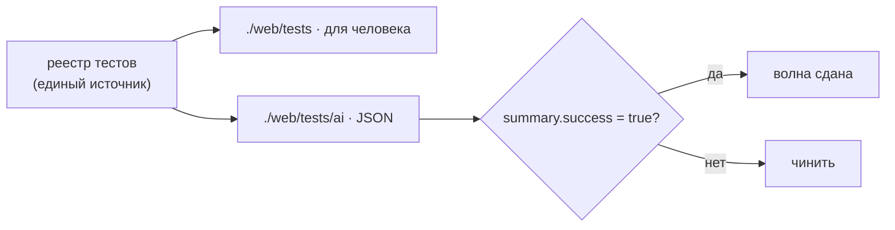

- **«Зелёный» = машинный факт:** `./web/tests/ai` отдаёт `summary.success = true`. Гейт повторяемый (curl/расписание/CI).
- **Изоляция — на уровне строк, не таблиц.** Тест-модули с ключом `test-<uniq>`; всё под ними неймспейсится через `producerModuleKey`/`subscriberModuleKey`, чистится свипом по префиксу. **Динамических имён Heap-таблиц нет** — бьём по тем же боевым `t__broker__*` своего окружения (пары stage/prod, селектор по пути — §3). Read-back после `updateAll`/`update` может отставать → retry до 3 (§9.2).
- **Категории:** БД / API / функциональные / интеграционные (обязательные по платформе) + **конкурентность** (CAS, идемпотентный fan-out) и **лимиты** (payload 8 КБ, fetch-limit, бюджет каскада) — наши. Планка: API и таблицы 100 %, функции 80 %+, интеграционных ≥3.
- **Регрессия по волнам:** волна N сдана, когда её приёмка (§9.5.N) зелёная И все прежние тесты по-прежнему зелёные. Набор **рождается в волне 2** (первый боевой код); прогоны волны 1 — одноразовые замеры, в набор не входят.
- **Синергия:** лог-тест волны 2 логирует из боевого кода и читает обратно — это и есть прогон, подтверждающий `workspace_path` (открытый пункт §5.10.7).
- **Тактики от платформы:** перезабор проверяется малым `claimTimeoutMs` (ждать нечем — `setTimeout` на сервере нет); лог-тест двухфазный (запись в `account_logs` асинхронна).

---

## Открытые вопросы (в проработке)

Полный трекаемый чек-лист — [`spec.md` §0.1](spec.md#01-волны-разработки-и-чек-лист-готовности). Там же он разложен по **четырём волнам разработки** (прототип → MVP → beta → релиз): пункт попадает в волну по цене позднего решения — необратимое (форма строки, удаление данных) закрывается до первой боевой записи, ломающее (внешний контракт) — до первого внешнего потребителя, аддитивное откладывается сознательно. Ниже — только визуальная сводка.

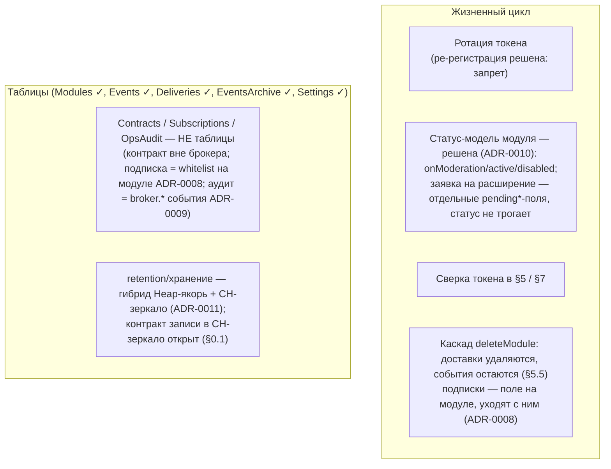
