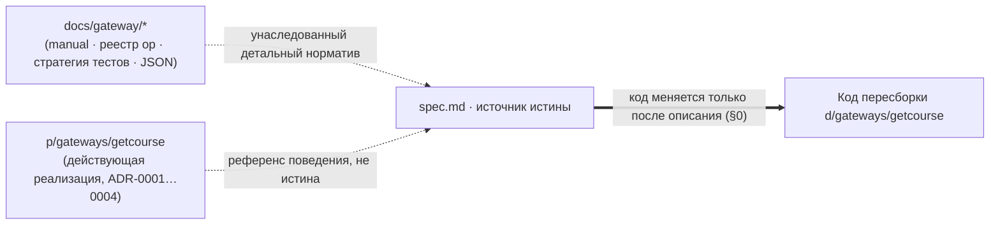
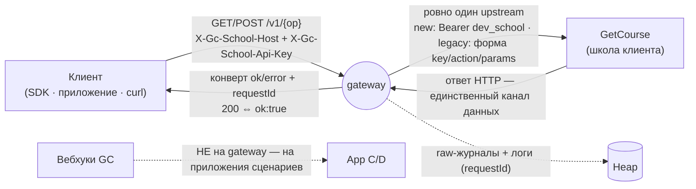
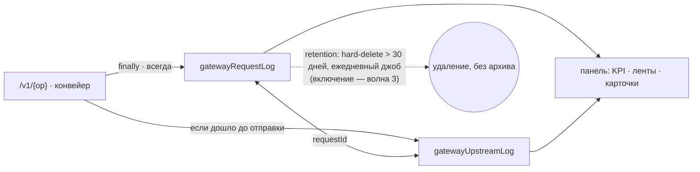
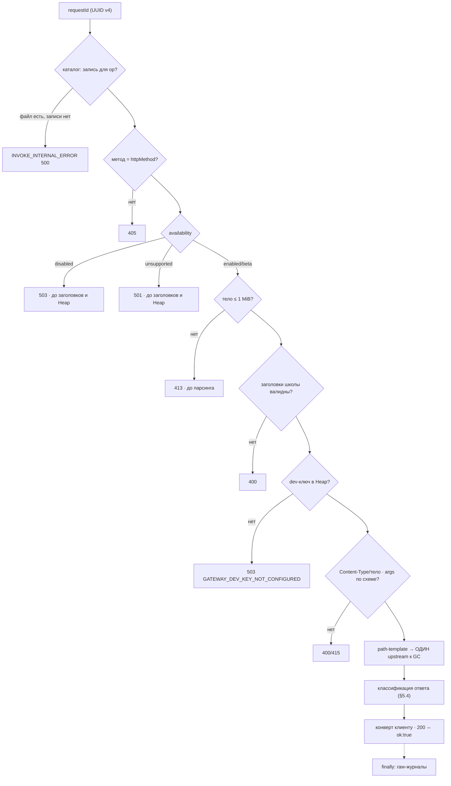
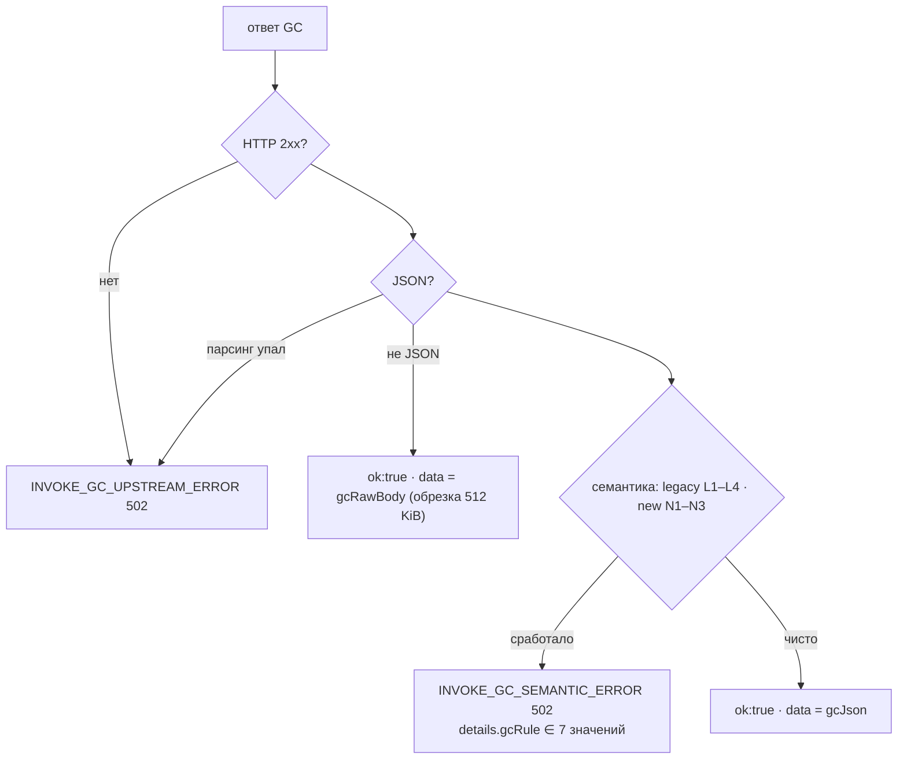
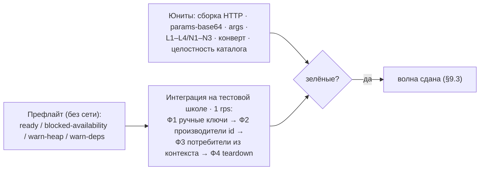
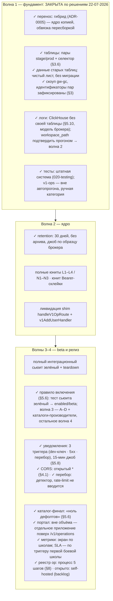

# Карта спецификации `getcourse-gateway` — слои и связи

Производный обзор зафиксированных решений. **Источник истины — [`spec.md`](spec.md)**; при расхождении приоритет за ним. Эта карта только визуализирует уже согласованное и не вводит новых правил.
Последнее обновление: 22-07-2026.

Слои (снизу вверх по абстракции):

- **Слой 0 — Методология и источники** — как ведётся спецификация и что унаследовано.
- **Слой 1 — Назначение и границы** — что такое gateway и чего он не делает.
- **Слой 2 — Хранилище (Heap)** — таблицы и открытые вопросы фундамента.
- **Слой 3 — Бизнес-логика** — конвейер `/v1/{op}`, каталог, контуры, классификация.
- **Слой 4 — Тестирование и приёмка** — юниты, интеграционный сьюит, волны.
- **Открытые вопросы** — сводка чек-листа волн.

---

## Слой 0 — Методология и источники

- **spec-as-source (§0).** Код проекта пересборки не правится, пока изменение не описано в `spec.md`. При расхождении спеки и manual приоритет за спекой, затем правится manual.
- **Действующая реализация — референс.** `p/gateways/getcourse` работает (59 op, конвейер, панель), но истиной не является: спека переописала её решения явно. **Перенос — гибрид (ADR-0005):** ядро (`lib/gateway/`, `api/v1/`, `shared/`-валидации) — копия с ревизией; обвязка (каркас, логгер, таблицы, тесты) — пересборка по решениям волны 1.
- **Внешний контракт уже опубликован.** Слой `/v1/*` имеет потребителей (SDK, client1–4) — весь публичный контракт заморожен с первого дня пересборки; ломающее — только `/v2` + ADR (§8).
- **Каркас пересборки** — `inner/samples/new_project`, с решениями волны 1 о логировании и тестах.

---

## Слой 1 — Назначение и границы (§1)

`getcourse-gateway` — тонкий stateless HTTP-фасад к двум контурам API GetCourse: единый слой `/v1/{op}` + каталог + нормализация ошибок + наблюдаемость каждого вызова.

- **Мультитенантность по заголовкам:** школа = `X-Gc-School-Host` + `X-Gc-School-Api-Key` на каждом запросе; ключи продакшен-школ gateway **не хранит** (§5.5). В Heap — только dev-ключ и тестовые ключи.
- **Один входящий → максимум один исходящий.** Ретраи и идемпотентность **запрещены** (жёсткое решение manual §8.6/§12.4): без `Idempotency-Key`, без журналов дедупа, без фоновых повторов. Повторы — у клиента.
- **Входящих вебхуков нет** (manual §6): вебхуки принимают прикладные приложения на свои URL с токеном; `setUri` — обычная исходящая операция.
- **Без сессии Chatium на `/v1/*`:** профиль доступа конфигурационный — dev-ключ настроен + валидные заголовки школы (§7).
- **Stateless между запросами:** каталог — статический TS-модуль в бандле, межзапросный кэш изолята контрактом не является.
- **Жёсткие константы:** таймаут upstream `GW_OUTBOUND_TIMEOUT_MS = 10_000`, лимит тела POST `GW_MAX_REQUEST_BODY_BYTES = 1 MiB` — константы кода, не настройки.

---

## Слой 2 — Хранилище (Heap, §3)

Ограничения платформы: индексы не управляются, индексируются только плоские корневые поля; лимит 1 млн строк закладывается retention'ом; подсчёты `countBy`/`where`.

| Таблица | Пара `t__gw-gc__…` (хвост) | Роль | Статус |
| --- | --- | --- | --- |
| `settings` | `setting` (`UqaXHv`) | key-value: dev-ключ, тестовые ключи, `gc_itest_*`, ключи панели | форма устоялась (строка = настройка) |
| `logs` | — | серверные логи | **упразднена** — ClickHouse-модель без своей таблицы (§5.10) |
| `panelAccess` / `panelInvites` | `paccess` (`sZlSgN`) / `pinvite` (`OmQgjP`) | гранты и инвайты доступа к панели | согласованы |
| `gatewayRequestLog` | `greq` (`T820qD`) | строка на каждый входящий `/v1/{op}` (PII-маска, `finally`); **+ плоское `schoolHost`** — фильтр по школе, фундамент метрик волны 4 | согласована; retention 30 дней (включение — волна 3) |
| `gatewayUpstreamLog` | `gups` (`hbI66D`) | строка на каждый исходящий вызов GC, связь 1:0..1 по `requestId` | согласована; retention общий |

- **Таблицы — парами stage/prod + селектор `IS_PROD` по `PROJECT_ROOT`** (решено 22-07-2026, §3.6; образец — брокер): dev-копия → stage-набор, prod-копия → prod-набор, одиночные `t__saas-gw-gc__*` новым кодом не используются. Идентификаторы пяти пар зафиксированы (§3, скоуп `gw-gc`); данные старых таблиц — чистый лист, без миграции (§3.6).
- **PII-маскирование** `redactRawDeep` (лимит 64 KiB) — до записи; секреты в журналы не попадают by construction.

---

## Слой 3 — Бизнес-логика (§5)

### Конвейер `/v1/{op}` (§5.1)

- **Per-op хендлер** в файле роута делает только явный выбор клиента (`invokeNewGcApi` / `invokeLegacyGcImportPost` / `invokeLegacyGcExportGet`); реестр `v1OpHandlers` — единый путь для роутов и тест-раннера (ADR-0004).
- **Каталог (§5.2)** — рукописный статический массив 59 записей (метаданные + `argsValidator` на `s` из `@app/schema` + plain `argsSchema.fields[]`); codegen упразднён; `GET /v1/operations` отдаёт `fields[]` (несовместимая смена с TypeBox зафиксирована ADR-0004).

### Классификация ответа GC (§5.4)

- **Секреты (§5.5):** dev-ключ — Heap, только в Bearer контура `new`; ключ школы — только заголовок, на провод уходит в Bearer (`new`) или `key` (`legacy`); запреты логирования — manual §5.7.
- **`availability` (§5.6)** — операционный рычаг каталога: `beta`-успех обязан нести `warnings` (`GATEWAY_OP_BETA_UNSTABLE`); текущее состояние — 6 `enabled` / 53 `disabled`. **Правило включения:** только при зелёном сценарии сьюита (`enabled` без оговорок / `beta` с оговорками); волна 3 — операции A–D (`addUser` первым) + каталоги-производители, остальное — волна 4.
- **Доступы к панели (§5.9):** Admin ИЛИ активный грант; инвайты TTL 7 дней, приём под `runWithExclusiveLock`; страница тестов — только Admin.
- **Наблюдаемость (§5.8):** raw-журналы + серверные логи (итоговая запись `v1_op_completed`) + панель; workspace-события `@start/sdk` не используются (ADR-0004). **KPI-сводка:** дешёвые счётчики — `countBy` по Heap; тяжёлые (p95/avg, topError) — из ClickHouse (`queryAi` по `v1_op_completed`; ключи payload — контракт); обязательная деградация без `@traffic/sdk`.

---

## Слой 4 — Тестирование и приёмка (§9)

Дизайн — [`gateway-testing-strategy.md`](../gateway/gateway-testing-strategy.md); исполнение — **штатная система тестов Chatium** (решено 22-07-2026, `020-testing.md`): `./web/tests/ai` · `summary.success` = машинный гейт волн. Сьюит `/v1/{op}` — **вне автопрогона** (живая школа): отдельная категория, ручной запуск.

- Интеграция запускается **только** для `enabled`/`beta`; одна сделка на сьюит; email всегда `tester@khudoley.pro`; артефакты — `[gateway-itest]`; деструктор сделки — `updateDealFields status:"false"`.
- Приёмка по волнам: 1 — каркас и решения фундамента; 2 — ядро `/v1` (рождается персистентный набор, негативные кейсы инварианта «200 ⇔ ok:true»); 3 — полный сьюит + панель + retention; 4 — целевой каталог, только рост набора.

---

## Открытые вопросы (в проработке)

Полный трекаемый чек-лист — [`spec.md` §0.2](spec.md#02-волны-разработки-и-чек-лист-готовности); пункт попадает в волну по цене позднего решения (необратимое → до первой боевой записи, ломающее → до первого потребителя, аддитивное — сознательно позже). Ниже — только сводка.

