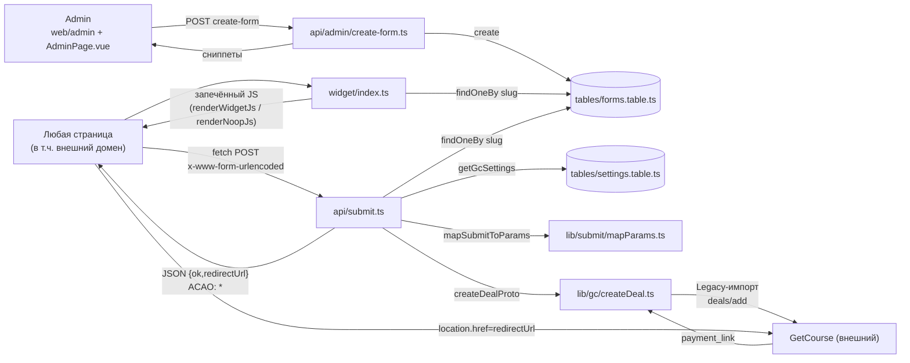

# Архитектура form-gen

Волна 1 (прототип). Источник требований — [`docs/spec/spec.md`](spec/spec.md); решение о способе встраивания форм — [`docs/ADR/0001-client-script-widget.md`](ADR/0001-client-script-widget.md) (разворот с серверного импорта на клиентский `<script>`-виджет — нужна поддержка внешних доменов).

## Поток данных

1. Админ (роль `Admin`) на странице [`web/admin/index.tsx`](../web/admin/index.tsx) + [`pages/admin/AdminPage.vue`](../pages/admin/AdminPage.vue) создаёt форму — вызывает [`api/admin/create-form.ts`](../api/admin/create-form.ts), который пишет запись в [`tables/forms.table.ts`](../tables/forms.table.ts) (slug + снимок offers) и возвращает сниппеты подключения (`<script src=...>` + `<div id=...>`).
2. Любая страница (внутри воркспейса или на внешнем домене) вставляет `<script src="…/widget?form=<slug>" async>`.
3. Роут [`widget/index.ts`](../widget/index.ts) читает форму по `slug` из `FormsTable` и рендерит JS через [`lib/widget/renderWidgetJs.ts`](../lib/widget/renderWidgetJs.ts) — конфиг (offers, appearance, CSS, URL отправки) **запечён в тело ответа** на сервере, повторного запроса за конфигом с клиента не требуется. Если формы нет — [`renderNoopJs`](../lib/widget/renderWidgetJs.ts) отдаёт пустой JS (тихая деградация, страница не ломается).
4. Клиентский JS из шага 3: подключает CSS (селекторы с префиксом `fg-`, [`lib/widget/styles.ts`](../lib/widget/styles.ts)), заменяет каждый `<div id="<slug>">` на inline-форму (при нескольких offers — `<select>`), регистрирует модалку `window.__formGen[slug] = { open(), close() }`, читает UTM-метки из `location.search`.
5. Посетитель отправляет форму — `fetch` POST `application/x-www-form-urlencoded` (simple request, без CORS-preflight) на абсолютный URL [`api/submit.ts`](../api/submit.ts).
6. Обработчик `submit.ts`: валидация обязательных полей → поиск формы по `slug` → проверка, что `offerId` входит в offers формы → чтение настроек GC ([`lib/settings/gcSettings.ts`](../lib/settings/gcSettings.ts), таблица [`tables/settings.table.ts`](../tables/settings.table.ts)) → маппинг тела запроса в параметры Legacy-импорта ([`lib/submit/mapParams.ts`](../lib/submit/mapParams.ts), гипотеза §5.4 спеки) → вызов GC ([`lib/gc/createDeal.ts`](../lib/gc/createDeal.ts)).
7. Ответ — JSON `{ ok: true, redirectUrl }` либо `{ ok: false, error }`, на **каждой** ветке (включая ошибки валидации и тихую деградацию) с заголовком `Access-Control-Allow-Origin: *` — эндпоинт публичный, без credentials, вызывается с чужого домена.
8. Клиент при `ok: true` делает `location.href = redirectUrl` (переход на страницу оплаты GC).



## Слои

- **`config/`** — [`routes.tsx`](../config/routes.tsx): `PROJECT_ROOT`, относительные `ROUTES`/`withProjectRoot` (для ссылок внутри воркспейса) и абсолютные `widgetAbsoluteUrl`/`submitAbsoluteUrl` (для `<script src>` и `fetch`, исполняемых на чужом домене, где `withProjectRoot` неприменим). [`constants.ts`](../config/constants.ts) — не-Heap настройки модуля волны 1: префикс слага, состав полей посетителя, дефолтный вид формы, ключи таблицы настроек, путь/action GC Legacy-импорта, таймаут исходящего запроса.
- **`tables/`** — Heap-таблицы, доступ только на сервере через `@app/heap`: [`forms.table.ts`](../tables/forms.table.ts) (конфигурация форм) и [`settings.table.ts`](../tables/settings.table.ts) (key-value настройки подключения GC). Подробности полей — [`docs/data.md`](data.md).
- **`lib/`** — серверная бизнес-логика, не тянет `api/`:
  - `settings/gcSettings.ts` — чтение/сохранение настроек GC, нормализация хоста школы;
  - `gc/` — **временный дубль** обвязки Legacy-импорта GetCourse (`createDeal.ts`, `legacyGcFormBody.ts`, `legacyGcImportClient.ts`, `utf8Base64.ts`); удаляется в волне 2 (MVP) при переходе на `getcourse`-гейтвей;
  - `submit/mapParams.ts` — маппинг полей формы в параметры Legacy-импорта (рабочая гипотеза §5.4 спеки, изолирована в одной точке для будущей правки);
  - `widget/` — `renderWidgetJs.ts` (сборка запечённого JS-виджета) и `styles.ts` (CSS с префиксом `fg-`);
  - `form/` — `slug.ts` (генерация formID, алфавит без `_`/`-` — валидный DOM-id/CSS-селектор) и `types.ts` (общие серверные типы `OfferSnapshot`/`FormAppearance`, в Vue не импортируются).
- **`api/`** — HTTP-обработчики: [`submit.ts`](../api/submit.ts) (публичный, CORS `*`), [`admin/create-form.ts`](../api/admin/create-form.ts) и [`admin/save-settings.ts`](../api/admin/save-settings.ts) (требуют `requireAccountRole(ctx, 'Admin')`). Таблица эндпоинтов — [`docs/api.md`](api.md).
- **`widget/`** — публичный роут `widget/index.ts`, отдаёт JS-скрипт виджета.
- **`web/` + `pages/`** — `web/admin/index.tsx` (SSR-роут, `requireAccountRole` первой строкой, данные передаются в Vue через SSR-пропсы) и `pages/admin/AdminPage.vue` (админ-интерфейс: настройки GC + создание/список форм). Vue не импортирует `tables/`, `lib/`, `config/` — только SSR-пропсы и `fetch` к admin API по абсолютным URL (`getFullUrl`, не `withProjectRoot` — иначе относительный путь резолвится от `.../web/admin` и даёт 404).
- **`index.tsx`** — корневая страница-заглушка (без Heap/авторизации), маркер того, что каталог обслуживается роутингом; ссылка на админку через `withProjectRoot`.

## Роутинг

File-based, один файл — один роут. Нестандартные (не `'/'`) сегменты:

| Файл | URL-сегмент | Причина |
|------|-------------|---------|
| [`widget/index.ts`](../widget/index.ts) | `widget` (без `.js`) | каталог с расширением в имени отклоняется sync-агентом Chatium («Directory name cannot end with .js»); `.js` в `<script src>` не обязателен, URL резолвится из каталога |
| [`web/admin/index.tsx`](../web/admin/index.tsx) | `web/admin` | группировка UI-роутов под `web/` |
| [`api/submit.ts`](../api/submit.ts), [`api/admin/*.ts`](../api/) | `api/...` | группировка HTTP-эндпоинтов под `api/` |

Ссылки внутри воркспейса — через `withProjectRoot`/`getFullUrl` из [`config/routes.tsx`](../config/routes.tsx), без хардкода URL. Для `<script src>` и `fetch`, исполняемых на внешних доменах, — абсолютные `widgetAbsoluteUrl(slug)` и `submitAbsoluteUrl()` (строятся от `DOMAIN` + `PROJECT_ROOT`, не от `withProjectRoot`).

## Структура каталогов

```
form-gen/
├── config/          routes.tsx, constants.ts
├── tables/          forms.table.ts, settings.table.ts
├── lib/
│   ├── settings/    gcSettings.ts
│   ├── gc/          createDeal.ts, legacyGcFormBody.ts, legacyGcImportClient.ts, utf8Base64.ts (временный дубль)
│   ├── submit/      mapParams.ts
│   ├── widget/      renderWidgetJs.ts, styles.ts
│   └── form/        slug.ts, types.ts
├── api/
│   ├── submit.ts
│   └── admin/       create-form.ts, save-settings.ts
├── widget/          index.ts
├── web/admin/       index.tsx
├── pages/admin/     AdminPage.vue
└── index.tsx
```

## Зависимости от платформы

- `@app/heap` — таблицы `FormsTable`, `FormGenSettings`.
- `@app/auth` — `requireAccountRole(ctx, 'Admin')` в admin-роутах.
- `@app/html-jsx` — серверный рендер `index.tsx` и `web/admin/index.tsx`.
- `@app/nanoid` — генерация formID ([`lib/form/slug.ts`](../lib/form/slug.ts)); дефолтный алфавит постобрабатывается (кастомный алфавит не поддерживается платформенным модулем).
- `ctx.account.log()` — единственный канал логирования на всех ветках (успех, ошибки валидации, тихая деградация, ответы GC); значения настроек GC (URL/ключи) в логи не попадают.
- GetCourse — внешняя система, вызывается напрямую HTTP из `lib/gc/*` (временный дубль обвязки гейтвея `p/gateways/getcourse`); в волне 2 заменяется вызовом `createDeal` через гейтвей, собственный GC-клиент из `form-gen` удаляется.

## Границы (§1 спеки)

Модуль не редактирует содержимое страниц, не отправляет уведомления, не строит аналитику (волна 1 — только логирование через `ctx.account.log`). A/B-тестирование предложений реализуется отдельными формами (разными `slug`), не встроенным механизмом.
