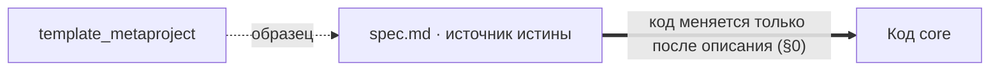
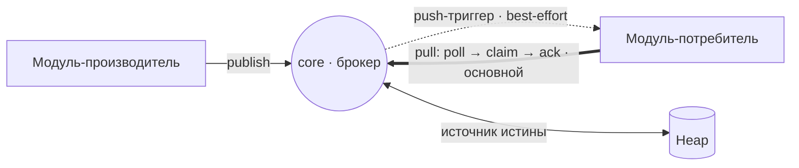
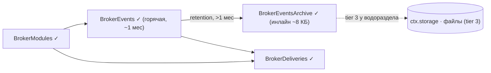
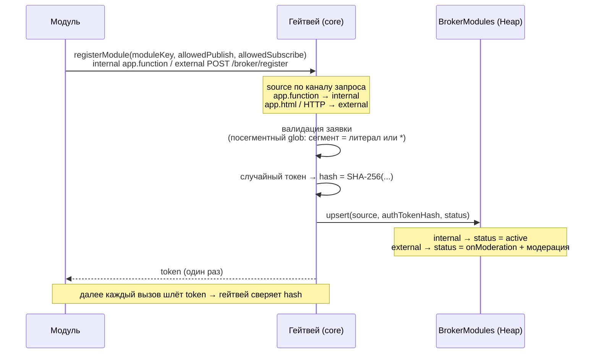
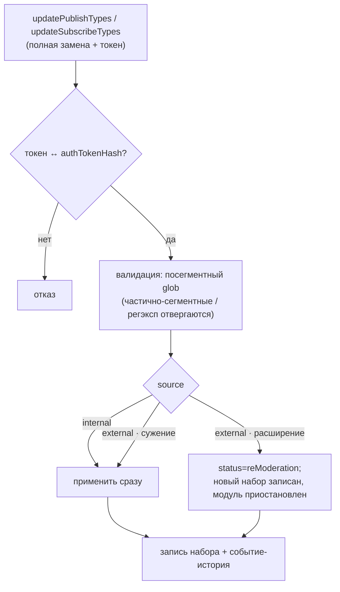
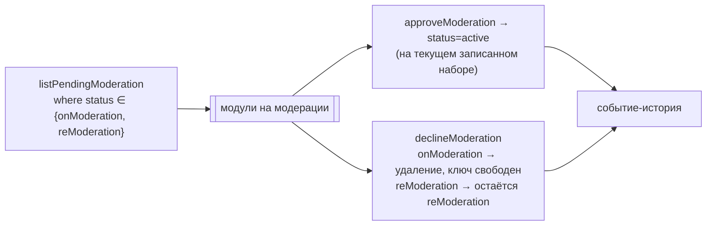
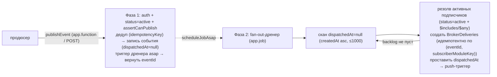
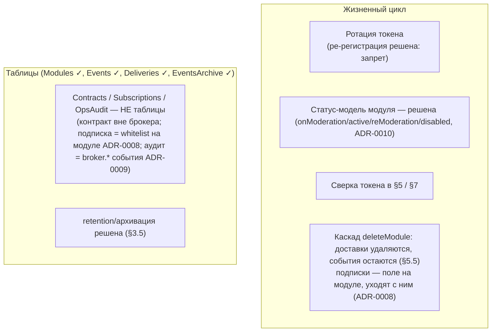

# Карта спецификации `core` — слои и связи

Производный обзор зафиксированных решений. **Источник истины — [`spec.md`](spec.md)**; при расхождении приоритет за ним. Эта карта только визуализирует уже согласованное и не вводит новых правил.
Последнее обновление: 02-07-2026.

Слои (снизу вверх по абстракции):

- **Слой 0 — Методология и принципы** — как ведётся сама спецификация.
- **Слой 1 — Назначение и транспорт** — что такое `core` и как течёт событие.
- **Слой 2 — Хранилище (Heap)** — таблицы брокера.
- **Слой 3 — Бизнес-логика** — хэширование токена и регистрация модуля.
- **Открытые вопросы** — что ещё в проработке.

---

## Слой 0 — Методология и принципы

- **spec-as-source (§0).** Редактировать код запрещено, пока изменение не описано в `spec.md`.
- **Связь с template.** Реализация списывается с `p/template_metaproject`, но им не является; при расхождении приоритет за спецификацией.
- **Словарь терминов.** Англоязычные термины — либо в словаре (если оправданы), либо переведены.
- **Состояние vs история.** На строке таблицы хранится только текущее состояние; история (вкл/выкл, регистрация) — отдельными событиями брокера.

---

## Слой 1 — Назначение и транспорт

`core` — серверное ядро BPM «FLOW» и брокер событий поверх Heap.

- **Транспорт — pull-driven** (ADR-0004): подписчик сам забирает доставки (`poll→claim→ack`); push — только best-effort **триггер** «проснись», данные не переносит.
- **Самодостаточная доставка:** несёт снимок события (`payload`), обрабатывается из своей таблицы; общий журнал/архив на рантайме **не читаются** (они — история/аудит). Отставший подписчик payload не теряет.
- **Ретраи — на стороне модуля:** просроченную `claimed` (старше `claimTimeoutMs`, §3.1) подписчик перезабирает сам на следующем pull; число попыток и внутреннюю очередь ведёт модуль; исчерпав — ставит `dead`. Брокер не ретраит и не пушит повторно.
- **Контракт `payload` — вне брокера:** структуру данных согласуют между собой продюсер и подписчики в своём коде; брокер переносит `schemaVersion` непрозрачным тегом, не хранит и не валидирует сам контракт (§8).
- **Гарантия:** at-least-once; потребитель обязан быть идемпотентным; порядок — best-effort по `createdAt` доставки.
- **Источник истины** о статусе доставки — таблицы брокера.

---

## Слой 2 — Хранилище (Heap)

### `BrokerModules` — реестр модулей (согласована)

| Поле | Назначение |
|------|-----------|
| `moduleKey` | Уникальный ключ модуля. Ключ upsert. |
| `displayName` | Имя для админ-диагностики. |
| `source` | `internal` / `external`. Проставляет гейтвей по каналу регистрации, не из тела запроса. |
| `allowedPublishTypes` | Белый список glob-паттернов публикаций. Пустой = запрет. |
| `allowedSubscribeTypes` | Белый список glob-паттернов подписок. Пустой = запрет. Fan-out резолвит подписчиков из этого поля: `where status=active` + развёртка предков-глобов `eventType` + `$includes/$any` (индексируемо) — доставки только активным; отдельной таблицы подписок нет, роутинг по типу, продюсер анонимен (ADR-0008). |
| `status` | Состояние в обмене **единым полем** (заменяет `enabled`/`adminDisabled`, ADR-0010): `onModeration` / `active` / `reModeration` / `disabled`. «Активен сейчас» = `active`; `disabled` только из `active`. Переходы — `broker.*` события (ADR-0009). Начальное по `source` (см. Слой 3). |
| `claimTimeoutMs` | Таймаут перезабора взятой доставки, задаёт модуль при регистрации (visibility-timeout применяет сам подписчик, §3.3). |
| `authTokenHash` | SHA-256 токена, выданного гейтвеем. Токен отдаётся модулю один раз. |
| `metadata` | Произвольные данные модуля. |

Системные поля Heap (добавляются автоматически, не объявляются): `id` — первичный ключ строки (идентичность модуля — по `moduleKey`, см. ADR-0001); `createdAt` / `updatedAt` — время создания строки / последнего upsert.

### `BrokerEvents` — журнал опубликованных событий (согласована)

Неизменяемый append-only журнал фактов; источник истины (§1). Фактическая часть события не редактируется (мутирует лишь служебный `dispatchedAt`, разовый `null → timestamp`) и не удаляется — при удалении модуля его события остаются (§5.5).

| Поле | Назначение |
|------|-----------|
| `eventType` | Доменный тип (`tasks.created`). Сверяется с `allowedPublishTypes` при публикации, `allowedSubscribeTypes` при доставке. |
| `schemaVersion` | Версия схемы `payload` внутри типа (целое, default `1`). Отдельным полем — для `where`-фильтра по версии **по индексу** (внутрь `any`-payload Heap тоже умеет, но неиндексированным сканом JSONB — медленнее, ADR-0003); непрозрачный тег, брокер контракт по `(eventType, schemaVersion)` не хранит и не проверяет (§1, §8). Бамп ≠ новый тип (вайтлисты/модерация не трогаются). ADR-0003. |
| `producerModuleKey` | `moduleKey` продюсера обычной строкой (не `RefLink`, §5.5). Multi-producer: один тип — у разных модулей. |
| `payload` | Данные факта (JSON). Структуру по `(eventType, schemaVersion)` согласуют продюсер и подписчики в своём коде — вне брокера (§1, §8). |
| `idempotencyKey` | Дедуп публикации от продюсера (опц., пусто → без дедупа). Уникальность `(producerModuleKey, idempotencyKey)`, проверка `runWithExclusiveLock` (§5). || `dispatchedAt` | `number \| null`. «fan-out завершён» — ставится **после всех** строк `BrokerDeliveries`; `null` → рассылка не завершена (восстановление повторяет fan-out). Единственное мутируемое поле. |

Системные поля: `id` — идентификатор события (на него ссылаются `BrokerDeliveries` строкой); `createdAt` — момент публикации (отметка для best-effort порядка); `updatedAt` не используется (журнал неизменяем).

Служебные поля публикации (объявлены выше; сам flow — `publishEvent` + fan-out-дренер, §5.8): дедуп события по `(producerModuleKey, idempotencyKey)`; `dispatchedAt` ставит **дренер** после ВСЕХ доставок, fan-out **асинхронный** (дренер сканирует `dispatchedAt=null`, он же recovery); **повтор fan-out идемпотентен по ключу ДОСТАВКИ `(eventId, subscriberModuleKey)`, а не по `idempotencyKey` события** (два слоя идемпотентности, разные ключи). Порядок — best-effort по `createdAt` (счётчик `seq` убран, глобальный лок не окупает). История операций — **решена**: системные `broker.*` события в этом же журнале (продюсер — внутренний код брокера, сентинел `producerModuleKey=broker`, в обход `assertCanPublish`; namespace `broker.` и `moduleKey=broker` зарезервированы — публиковать модулям нельзя, подписываться можно), фан-аут единообразный, отдельной таблицы нет (ADR-0009).

### `BrokerDeliveries` — материализованные доставки (согласована)

**Самодостаточный рабочий элемент для pull** (ADR-0006). fan-out создаёт по строке на каждого подписчика события (§3.2) и **кладёт в неё снимок события** (`eventType` + `schemaVersion` + `payload`). Модуль обрабатывает целиком из своей таблицы — **общий журнал на рантайме не читает** («толстая» доставка: меньше запросов и точек отказа, ценой временного дублирования payload). Жизненный цикл ведёт сам подписчик через pull (§1), брокер хранит статус.

| Поле | Назначение |
|------|-----------|
| `eventId` | `id` события строкой (не `RefLink`) — обратная ссылка для трассировки, **не** для дозагрузки. |
| `eventType` | Тип-снимок: фильтр pull + вход бизнес-логики. |
| `schemaVersion` | Версия схемы `payload` (снимок): по `(eventType, schemaVersion)` подписчик знает, как читать payload. |
| `payload` | **Снимок данных события**, скопирован при fan-out — доставка самодостаточна. Маленький факт (обычно сотни байт; ~8 КБ — потолок записи, не цель; крупное — ссылкой на файл). |
| `subscriberModuleKey` | `moduleKey` подписчика строкой (не `RefLink`, §5.5). |
| `status` | `pending` → `claimed` → `acked` / `dead`. `failed` нет: неподтверждённая `claimed` = повтор (перезабор после таймаута). |
| `claimedAt` | Момент последнего claim; основа перезабора (просрочка по `claimTimeoutMs`, §3.1). |

Жизненный цикл: fan-out → `pending` (со снимком), идемпотентно по `(eventId, subscriberModuleKey)` (под `runWithExclusiveLock` по событию); на pull подписчик берёт свои `pending` + просроченные `claimed` (порядок по `createdAt` доставки), ставит `claimed`+`claimedAt`, обрабатывает **прямо по строке**, успех → `acked`, упал → перезабор после таймаута; исчерпав попытки (политика модуля) → `dead`. Опц. поля: `attempts`, `lastError` (без `subscriptionId` — отдельной сущности-подписки нет, матч по типу через whitelist, ADR-0008). Системные: `id`, `createdAt` (материализация; основа retention и порядка), `updatedAt` (последний переход). `eventCreatedAt` не нужен (порядок — по `createdAt` доставки).

### `BrokerEventsArchive` — холодный архив журнала (согласована)

Журнал — **неизменяемая история** (аудит, ре-материализация, ручной разбор); на рантайме доставки не читается (доставка самодостаточна). Лимит 1 млн строк/таблицу несовместим с ростом, удалять события нельзя → **трёхуровневое хранение** (ADR-0005): (1) горячая `BrokerEvents` = последний месяц (+ небольшой «хвост»); (2) **инлайновые строки архива ~8 КБ** (оптимум записи Heap, `008-heap.md`; данные в самой таблице, запрос через `where`); (3) **замороженные строки** — при исчерпании архива старые инлайновые строки выгружаются в файлы `ctx.storage`, вместо них индексная строка с `fileId` (tier 3, ADR-0007). Поля: `batchFrom`/`batchTo` (диапазон), `count`, `events` (инлайн) / `fileId` (заморозка). Граница инлайн-строки — по размеру: суммируем `JSON.stringify(ev).length` (символы; `Buffer`/`TextEncoder` в UGC может не быть — `047-base64.md`), таргет ~8 КБ, сбрасываем только **полную**. Чтение уровней 2–3 — только диагностика/админка (`where` по диапазону / `getFileStream`). Ёмкость: tier 2 — единицы-десятки млн, tier 3 — ещё ×порядки.

**Retention-джоб (ежедневно в полночь, общий для брокера).** Один `app.job` каждую полночь, самоперепланирование `scheduleJobAt(00:00)`, три прохода:
1. **Очистка доставок:** `acked` старше 24ч и `dead` старше 30 дней → `deleteAll` батчами по 1000 (dead **не архивируем** — оперативная диагностика, факт события хранит журнал). `pending`/`claimed` не трогаются.
2. **Архивация событий старше месяца, строки по ~8 КБ:** тянем старые (`updatedAt < now−1мес`, `asc`), набираем полную строку → `BrokerEventsArchive`. «Хвост» ждёт. Порядок «архив → удаление по `id`» — без потерь; полнота — по «остался невлезший кандидат».
3. **Выгрузка в файлы (tier 3), только у водораздела** (ADR-0007): при **700k** строк главный джоб лишь **оркеструет** — держим **200k** новейших оперативными, старые **500k** отдаём **10 независимым джобам** по непересекающимся диапазонам `batchFrom` (границы — offset-семплингом в одном потоке; стабильны под удалением). Джоб выгрузки пишет файлы **~40 МБ (≈5k строк)** — не один на слайс (400 МБ не влезли бы в 60 с/память); файл = **плоский массив событий** (`flatMap`, не массив батчей); имя — с датами первого/последнего события; store-then-delete. Всё под лимиты (60 с/джоб, 1000/запрос). В норме no-op.

### Топология хранилища (все таблицы согласованы)

Отдельных таблиц под контракты, подписки и операционный аудит **нет**: контракт `payload` — вне брокера (§1, §8 spec.md); подписка — whitelist по типу на строке модуля (роутинг по типу, продюсер анонимен, ADR-0008); операционная история — системные `broker.*` события в журнале `BrokerEvents` (ADR-0009).

---

## Слой 3 — Бизнес-логика

### §5.1 Хэширование токена

- Настоящий **SHA-256** через `@npm/node-forge` (нативного `crypto` в Chatium нет).
- Вход: `broker-module-auth:<moduleKey>:<token>` (доменный префикс + привязка к модулю).
- **Не** FNV-1a: `authTokenHash` — граница доверия, 32-битный отпечаток к подбору не устойчив.

### §5.2 Регистрация модуля

Хэш в БД при утечке рабочего креденциала не даёт: сравнивается хэш входящего токена, сам токен не хранится.

### §5.3 / §5.4 Обновление белых списков (черновик)

Смена `allowedPublishTypes` (§5.3, операция `updatePublishTypes` · `POST /broker/publish-types`) и `allowedSubscribeTypes` (§5.4, операция `updateSubscribeTypes` · `POST /broker/subscribe-types`) — отдельные операции, не ре-регистрация: `moduleKey` / `source` / токен неизменны. Создание — только `registerModule` (§5.2).

- `source` берётся из строки, **не** переопределяется каналом (в отличие от регистрации).
- Пустой массив = право отозвано (publish / subscribe запрещены).

### §5.5 Удаление регистрации (черновик)

`deleteModule` (`POST /broker/delete`) — токен-гейт, только по существующей строке, **без модерации** (сокращение присутствия, не расширение прав). Строка удаляется, факт — `broker.*` событием-историей; `moduleKey` **освобождается** → можно занять заново через `registerModule`. Админ-снятие — это статус `disabled`, не `deleteModule`.

**Каскад при удалении (решено):** события остаются (журнал/архив, строковый `producerModuleKey`); **все** доставки с `subscriberModuleKey` модуля удаляются независимо от статуса (иначе мисатрибуция при повторном занятии освободившегося ключа); подписки отдельно не каскадируются — это whitelist на строке `BrokerModules`, удаляется вместе с ней (ADR-0008).

Жизненный цикл: `registerModule` (create) → `updatePublishTypes` / `updateSubscribeTypes` (mutate) → `disableModule` / `enableModule` (админ: `active`↔`disabled`, §5.7) → `deleteModule` (remove, освобождает ключ).

### §5.6 Модерация

**Админ-операции** (`requireAccountRole admin`, не токен модуля). Не модульный API — вызываются из админ-страницы брокера через `.run()` (роут `// @shared-route`), без `app.function` и без HTTP-эндпоинта для модулей. Очередь = строки со статусом `onModeration` или `reModeration` (только `external`); отдельной таблицы и полей ожидания нет. Под модерацию попадают: первичная регистрация (§5.2 → `onModeration`) и ре-модерация после расширения типов (§5.3/§5.4 → `reModeration`). Идентификатор — `moduleKey`.

### §5.7 Выключение / включение (админ)

Помимо модерации — админ-операции `disableModule` (`active`→`disabled`, только из `active`) и `enableModule` (`disabled`→`active`, на текущем наборе). Выключенный модуль не участвует: публикации отклоняются, fan-out его пропускает (доставки — только `status=active`); уже созданные доставки ждут включения. Переходы — `broker.*` события.

### §5.8 publishEvent + fan-out-дренер

Центральная операция. **Двухфазная, fan-out асинхронный** (поглощает всплески публикаций без backpressure/потерь):

- Фаза 1 — минимум синхронной работы (запись + дедуп); скачок запросов не транслируется в скачок fan-out на Heap.
- Дренер = основной путь fan-out **и** recovery (незавершённое = `dispatchedAt=null`, подхватится). Отдельной `@app/jobs`-очереди на fan-out не нужно — очередь это сам журнал (`dispatchedAt=null`).
- Порядок best-effort по `createdAt`; auth: external — токен, internal — платформенный caller-context. Bulk — чанкует **продюсер** своей custom job queue (`005-jobs.md`); batch-publish пока не вводится (иначе с кэпом / брокерской очередью приёма).

---

## Открытые вопросы (в проработке)

Полный трекаемый чек-лист (пустые разделы, недостающие таблицы, операции flow публикации/доставки, ротация токена, контракты модерации) — [`spec.md` §0.1](spec.md#01-чек-лист-готовности-спецификации). Ниже — только визуальная сводка.

