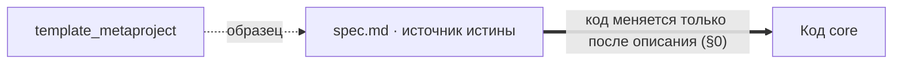
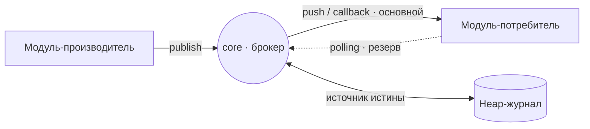
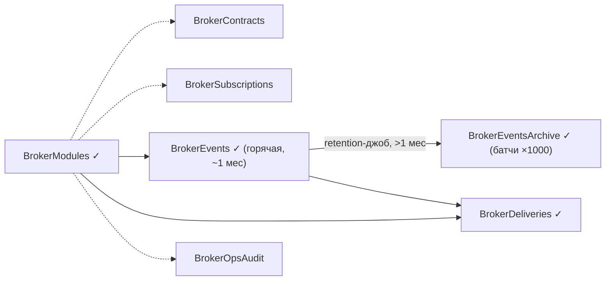
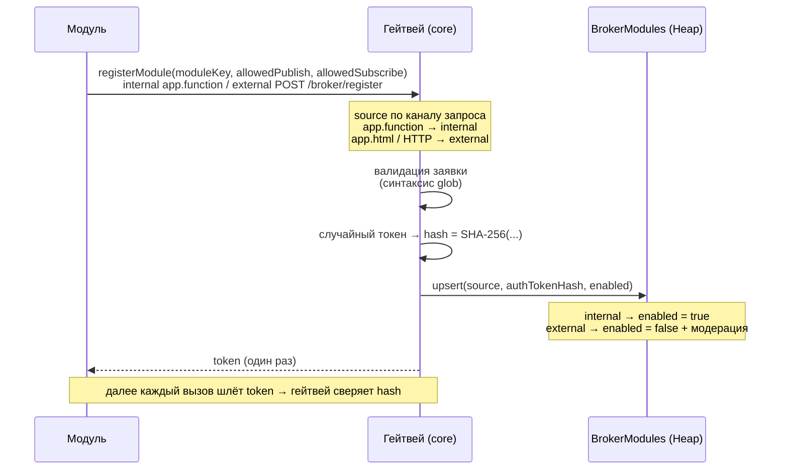
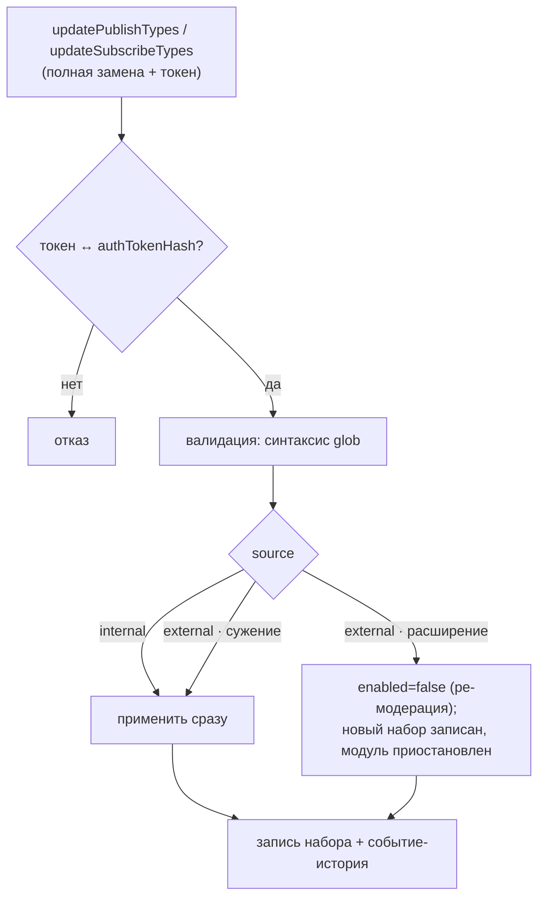
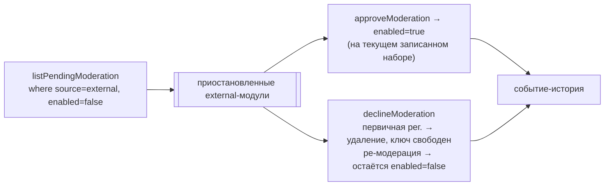
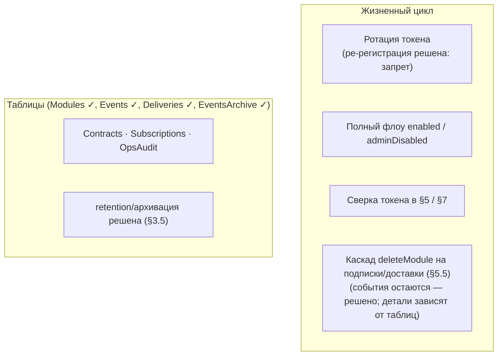

# Карта спецификации `core` — слои и связи

Производный обзор зафиксированных решений. **Источник истины — [`spec.md`](spec.md)**; при расхождении приоритет за ним. Эта карта только визуализирует уже согласованное и не вводит новых правил.
Последнее обновление: 01-07-2026.

Слои (снизу вверх по абстракции):

- **Слой 0 — Методология и принципы** — как ведётся сама спецификация.
- **Слой 1 — Назначение и транспорт** — что такое `core` и как течёт событие.
- **Слой 2 — Хранилище (Heap)** — таблицы брокера.
- **Слой 3 — Бизнес-логика** — хэширование токена и регистрация модуля.
- **Открытые вопросы** — что ещё в проработке.

---

## Слой 0 — Методология и принципы

- **spec-as-source (§0).** Редактировать код запрещено, пока изменение не описано в `spec.md`.
- **Связь с template.** Реализация списывается с `p/template_metaproject`, но им не является; при расхождении приоритет за спецификацией.
- **Словарь терминов.** Англоязычные термины — либо в словаре (если оправданы), либо переведены.
- **Состояние vs история.** На строке таблицы хранится только текущее состояние; история (вкл/выкл, регистрация) — отдельными событиями брокера.

---

## Слой 1 — Назначение и транспорт

`core` — серверное ядро BPM «FLOW» и брокер событий поверх Heap.

- **Транспорт:** push/callback — основной канал; polling — резервный канал надёжности.
- **Гарантия:** at-least-once; потребитель обязан быть идемпотентным; порядок — best-effort по времени публикации.
- **Источник истины** о состоянии доставки — всегда Heap-журнал.

---

## Слой 2 — Хранилище (Heap)

### `BrokerModules` — реестр модулей (согласована)

| Поле | Назначение |
|------|-----------|
| `moduleKey` | Уникальный ключ модуля. Ключ upsert. |
| `displayName` | Имя для админ-диагностики. |
| `source` | `internal` / `external`. Проставляет гейтвей по каналу регистрации, не из тела запроса. |
| `allowedPublishTypes` | Белый список glob-паттернов публикаций. Пустой = запрет. |
| `allowedSubscribeTypes` | Белый список glob-паттернов подписок. Пустой = запрет. |
| `enabled` | Активность. Начальное значение по `source` (см. Слой 3). |
| `adminDisabled` | Админ-стоп, приоритет над `enabled`. История — в событиях. |
| `authTokenHash` | SHA-256 токена, выданного гейтвеем. Токен отдаётся модулю один раз. |
| `metadata` | Произвольные данные модуля. |

Системные поля Heap (добавляются автоматически, не объявляются): `id` — первичный ключ строки (идентичность модуля — по `moduleKey`, см. ADR-0001); `createdAt` / `updatedAt` — время создания строки / последнего upsert.

### `BrokerEvents` — журнал опубликованных событий (согласована)

Неизменяемый append-only журнал фактов; источник истины (§1). Событие не редактируется и не удаляется — при удалении модуля его события остаются (§5.5).

| Поле | Назначение |
|------|-----------|
| `eventType` | Доменный тип (`tasks.created`). Сверяется с `allowedPublishTypes` при публикации, `allowedSubscribeTypes` при доставке. |
| `producerModuleKey` | `moduleKey` продюсера обычной строкой (не `RefLink`, §5.5). Multi-producer: один тип — у разных модулей. |
| `payload` | Данные факта (JSON), по контракту типа (`BrokerContracts`, в проработке). |

Системные поля: `id` — идентификатор события (на него ссылаются `BrokerDeliveries` строкой); `createdAt` — момент публикации (отметка для best-effort порядка); `updatedAt` не используется (журнал неизменяем).

Поля flow публикации (§5, в проработке, в схему пока не входят): `idempotencyKey` (дедуп публикации), `dispatchedAt` (fan-out выполнен), версия `payload` / порядковый номер. Граница с историей операций (`BrokerOpsAudit` vs системные события здесь) — открытый вопрос.

### `BrokerDeliveries` — материализованные доставки (согласована)

Рабочая очередь: fan-out создаёт по строке на каждого подписчика события (§3.2). Состояние на пару «событие × подписчик» — жизненный цикл `poll → claim → ack / fail` (§1). По этим строкам идут и push, и polling; dead-letter — признак строки.

| Поле | Назначение |
|------|-----------|
| `eventId` | `id` события из `BrokerEvents` строкой (не `RefLink`). |
| `eventType` | Денормализованный тип — polling-фильтр без джойна к журналу. |
| `subscriberModuleKey` | `moduleKey` подписчика строкой (не `RefLink`, §5.5). |
| `status` | `pending` → `claimed` → `acked` / `failed` → `dead` (dead-letter). |

Поля flow доставки (§5, в ядро пока не входят): `attempts`, `claimedAt`, `nextAttemptAt`, `lastError`, `subscriptionId`. Системные: `id`, `createdAt` (материализация; основа retention), `updatedAt` (последний переход).

### `BrokerEventsArchive` — холодный архив журнала (согласована)

Лимит 1 млн строк/таблицу несовместим с растущим неизменяемым журналом (§3.2), удалять события нельзя → **двухуровневое хранение**: горячая `BrokerEvents` = последний месяц, старше — **упаковка батчами до 1000 событий в одну строку архива** (ёмкость ×1000, до ~1 млрд). Поля: `batchFrom`/`batchTo` (диапазон `createdAt`), `count` (≤1000), `events` (JSON-массив строк **в самой таблице** — запрашивается через `where`; при слишком большом батче дробим на несколько строк, наружу в `ctx.storage` не выносим). Строковые `eventId` из доставок не ломаются (не `RefLink`). `ctx.storage` — лишь запасной путь на далёкое будущее при переполнении самого архива (~1 млрд, недостижимо — не реализуем сейчас).

**Retention-джоб (ежедневно в полночь, общий для брокера).** Один `app.job` каждую полночь, самоперепланирование `scheduleJobAt(00:00)`, два прохода:
1. **Очистка доставок:** `acked` старше 24ч → `deleteAll` батчами по 1000. `pending`/`claimed`/`failed` не трогаются.
2. **Архивация старше месяца (батчами по 1000):** `BrokerEvents` → `BrokerEventsArchive`; `dead`-доставки → свой архив (закрывает вопрос роста dead-letter). Порядок «сначала архив, потом удаление по `id`» — без потерь при сбое; лимит батчей за прогон, остаток догоняет следующая полночь.

### Остальные таблицы — в проработке

`BrokerContracts`, `BrokerSubscriptions`, `BrokerOpsAudit` — поля ещё не согласованы (пунктир = намеченная связь).

---

## Слой 3 — Бизнес-логика

### §5.1 Хэширование токена

- Настоящий **SHA-256** через `@npm/node-forge` (нативного `crypto` в Chatium нет).
- Вход: `broker-module-auth:<moduleKey>:<token>` (доменный префикс + привязка к модулю).
- **Не** FNV-1a: `authTokenHash` — граница доверия, 32-битный отпечаток к подбору не устойчив.

### §5.2 Регистрация модуля

Хэш в БД при утечке рабочего креденциала не даёт: сравнивается хэш входящего токена, сам токен не хранится.

### §5.3 / §5.4 Обновление белых списков (черновик)

Смена `allowedPublishTypes` (§5.3, операция `updatePublishTypes` · `POST /broker/publish-types`) и `allowedSubscribeTypes` (§5.4, операция `updateSubscribeTypes` · `POST /broker/subscribe-types`) — отдельные операции, не ре-регистрация: `moduleKey` / `source` / токен неизменны. Создание — только `registerModule` (§5.2).

- `source` берётся из строки, **не** переопределяется каналом (в отличие от регистрации).
- Пустой массив = право отозвано (publish / subscribe запрещены).

### §5.5 Удаление регистрации (черновик)

`deleteModule` (`POST /broker/delete`) — токен-гейт, только по существующей строке, **без модерации** (сокращение присутствия, не расширение прав). Строка удаляется, факт — событием-историей; `moduleKey` **освобождается** → можно занять заново через `registerModule`. Админ-снятие — это `adminDisabled`, не `deleteModule`.

**Каскад при удалении (решено):** опубликованные события остаются в журнале, подписки и незавершённые доставки снимаются. Технические детали — вместе с дизайном таблиц §3.

Жизненный цикл: `registerModule` (create) → `updatePublishTypes` / `updateSubscribeTypes` (mutate) → `deleteModule` (remove, освобождает ключ).

### §5.6 Модерация

**Админ-операции** (`requireAccountRole admin`, не токен модуля). Не модульный API — вызываются из админ-страницы брокера через `.run()` (роут `// @shared-route`), без `app.function` и без HTTP-эндпоинта для модулей. Очередь = строки с `enabled = false` (только `external`); отдельной таблицы и pending-полей нет. Под модерацию попадают: первичная регистрация (§5.2) и ре-модерация после расширения типов (§5.3/§5.4). Идентификатор — `moduleKey`.

---

## Открытые вопросы (в проработке)

